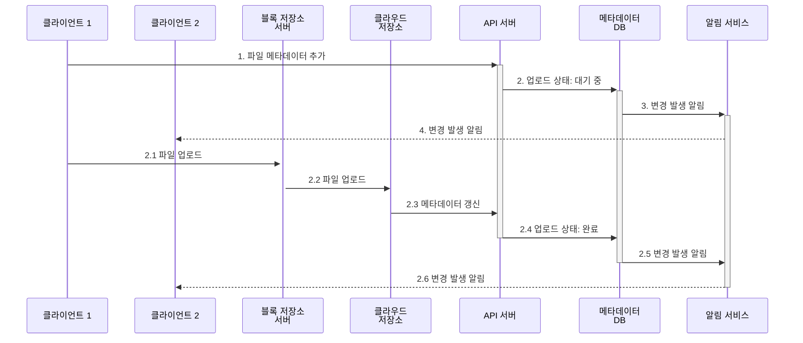
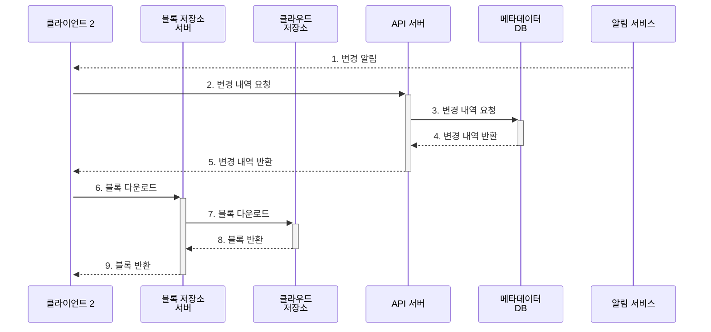

---
aliases:
  - |-
    15장 구글드라이브설계
    16장 배움은계속된다
---
# 15장 구글 드라이브 설계

## 1단계 문제 이해 및 설계 범위 확정

- 파일 추가. 파일을 구글 드라이브 안에 떨구는(drag-and-drop) 것이다.
- 파일 다운로드.
- 여러 단말에 파일 동기화
- 파일 갱신 이력 조회(revision history)
- 파일 공유
- 파일이 편집되거나 삭제되거나 새롭게 공유되었을 때 알림 표시

### 비 기능적 요구사항

- 안정성: 데이터 손실이 발생하면 안 된다.
- 빠른 동기화 속도
- 네트워크 대역폭: 네트워크 대역폭을 불필요하게 많이 소모한다면 사용자는 좋아하지 않을 것이다.
- 규모 확장성: 아주 많은 양의 트래픽도 처리 가능해야 한다.
- 높은 가용성: 일부 서버에 장애가 발생하거나, 느려지거나, 네트워크 일부가 끊겨도 시스템은 계속 사용 가능해야 한다.

### 개략적 추정치

- 사용자 5천만, 천만 명의 DAU
- 모든 사용자에게 10GB 무료 저장공간 할당
- 각 사용자가 평균 2개의 파일을 업로드한다고 가정.
- 읽기 쓰기 비율은 1:1
- 서비스 필요 저장공간: 500PB
- 업로드 API QPS 240
- 최대 QPS 480

## 2단계 개략적 설계안 제시 및 동의 구하기

- 네임스페이스(namespace)라는 이름으로 사용자별 파일을 구분지어 사용할 수 있도록 한다.
    - 이렇게하면 보안에 취약하니 텐넌트 별로 구분을 지을 수 있도록 하는게 좋다.

### API

1. 파일 업로드 API
    - 단순 업로드: 파일 크기가 작을떄
    - 이어 올리기(resumable upload): 파일 사이즈가 크고 네트워크 문제로 업로드가 중지될 가능성이 높을 때
2. 파일 다운로드 API
3. 파일 갱신 히스토리 API

### 한 대 서버의 제약 극복

- 여유 용량이 부족할때, 데이터를 샤딩(sharding)하여 여러 서버에 나누어 저장하는 것.

### 동기화 충돌

**사용자 충돌 오류 발생시 해결 방법**

- 두 파일을 하날 합칠지 아니면 둘 중 하나를 다른 파일로 대체할지를 결정해야한다.

### 개략적 설계안

- 사용자 단말
    - 사용자가 이용하는 웹브라우저나 모바일 앱등 클라이언트
- 블록 저장소 서버(block server)
    - 파일 블록을 클라우드 저장소에 업로드하는 서버
    - 이 저장소는 파일을 여러개의 블록으로 나눠 저장하며, 각 블록에는 고유한 해시값이 할당됨.
    - 이 해시값은 메타데이터 데이터베이스에 저장됨.
    - 각 블록은 독립된 객체로 취급되며 클라우드 저장소 시스템에 보관 (이 설계에선 s3)
    - 파일을 재구성하려면 블록들을 원래 순서대로 합쳐야 함.
    - 블록의 크기는 최대 4MB
- 클라우드 저장소
    - 블록 단위로 나눠져 클라우드 저장소에 보관.
- 아카이빙 저장소(cold storage)
    - 오랫동안 사용되지 않는 비활성(inactive) 데이터를 저장하기 위한 컴퓨터 시스템
- 로드밸런서
    - 트래픽 분산
- API 서버
    - 파일 업로드 외 모든 것을 담당
- 메타데이터 데이터베이스
    - 사용자, 파일, 블록, 버전 등의 메타데이터 정보를 관리.
    - 파일은 없고, 메타데이터만 저장한다.
- 메타데이터 캐시
    - 자주 쓰는건 캐시로!
- 알림 서비스
    - Pub/Sub 프로토콜 기반
- 오프라인 사용자 백업 규
    - 이 큐에 두어 나중에 클라이언트가 접속했을 때 동기화될 수 있도록 구성.

## 3단계 상세 설계

### 블록 저장소 서버

- 업데이트시 최적화 방법
    - 델타 동기화 (delta sync)
        - 수정이 일어난 블록만 동기화 하는 방법
    - 압축 (compression)
        - 블록 단위로 압축해서 데이터 크기를 줄이는 방법

### 높은 일관성 요구사항

- 강한 일관성 (strong consistency) 모델을 기본으로 지원해야한다.
    - 같은 파일이 단말이나 사용자에 따라 다르게 보이는 것은 호용할 수 없다는 뜻.
    - 메타데이터 캐시와 데이터베이스 계층에도 동일한 원칙이 적용되어야 함.
- 메모리 케시는 최종 일관성 (eventual consistency) 모델을 지원하기에 강항 일관성을 달성하려면 다음 사항을 보장 해야함.
    - 캐시에 보관된 사본과 데이터베이스에 있는 원본(original)이 일치
    - 데이터베이스에 보관된 원본에 변경이 발생하면 캐시에 있는 사본은 무효화함.

### 메타데이터 데이터베이스

보고 넘어가요~

### 업로드 절차

### 다운로드 절차

### 알림 서비스

- 파일의 일관성을 유지하기위해서 특정 클라이언트에서 파일이 수정되었음을 감지하여 다른 클라이언트에 그 사실을 알려 충돌 가능성을 줄이는데 알림 서비스가 이용된다.
- 롱 폴링(long polling)이 좋은 이유
    - 서버는 파일이 변경된 사실을 클라이언트에게 알려주어야 하지만 반대 방향(클라이언트가 서버로)의 통신은 요구되지 않는다.
    - 알림을 보낼 일은 그렇게 자주 발생하지 않으며, 알림을 보내야 하는 경우에도 단시간에 많은 양의 데이터를 보낼 일은 없다.
- 롤 폴링 동작
    - 각 클라이언트는 알림 서버와 롱 폴링용 연결을 유지하다가 특정 파일에 대한 변경을 감지하면 해당 연결을 끊는다.
    - 메타데이터 서버와 연결하여 최신 내역을 다운로드.
    - 다운로드가 끝났거나 연결 타임아웃 시간에 도달한 경우, 즉시 새 요청을 보내어 롱 폴링 연결을 복원하고 유지하게됨.

### 저장소 공간 절약

- 저장 용량을 아끼고, 비용 절감하기 위해 사용하는 세가지 방법
    - 중복 제거(de-dupe)
        - 해시값이 같으면 동일한 파일로 보고 없앤다.
    - 지능적 백업 전략
        - 한도 설정: 보관해야하는 파일 버전 개수에 상한을 두는것. 오래된 버전을 버림.
        - 중요한 버전만 보관
    - 자주 사용하지 않는 데이터는 아카이빙 저장소(cold storage)로 옮김.

### 장애 처리

- 로드밸런서 장애 → 클라우드는 고려할필요없음.
- 블록 저장소 서버 장애 → 동일한 작업을 하는 누군가가 받아서 미완료 상태 또는 대기 상태인 작업을 해야한다.
    - 이중화!
- 클라우드 저장소 장애 → region을 다른곳에.. (비용은…?)
- API 서버 장애 → stateless 서버라 이중화만 잘해두면 될듯.
- 메타데이터 캐시 장애 → 이중화
- 메타데이터 데이터베이스 장애
    - 주 데이터베이스 서버 장애 → 페일 오버 Failover
    - 부 데이터베이스 서버 장애 → 새로운 리드리플리카 연결
- 알림 서비스 장애 → 빠른 복구말고는….?
- 오프라인 사용자 백업 큐 장애 → 구독 중인 클라이언트들은 백업 큐로 구독 관계를 재설정해야함. 사용자에게 맡기는 방법도…

## 4단계 마무리

- 두가지 부분으로 나뉨
    - 파일의 메타데이터를 관리하는 부분
    - 파일 동기화를 처리하는 부분

# 16장 배움은 계속된다

홈페이지 목록이네…?